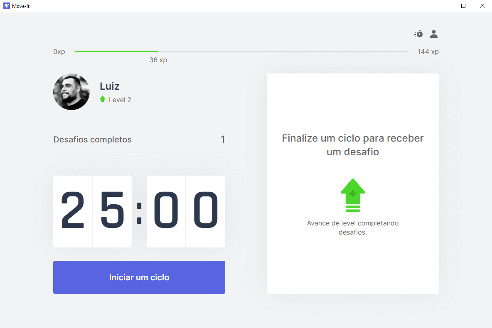
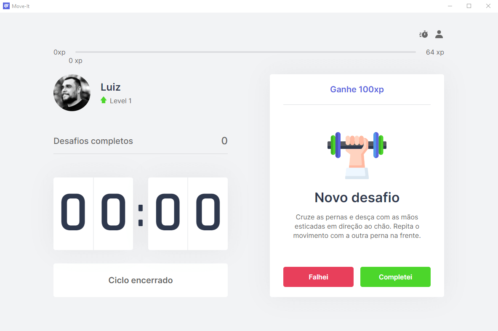
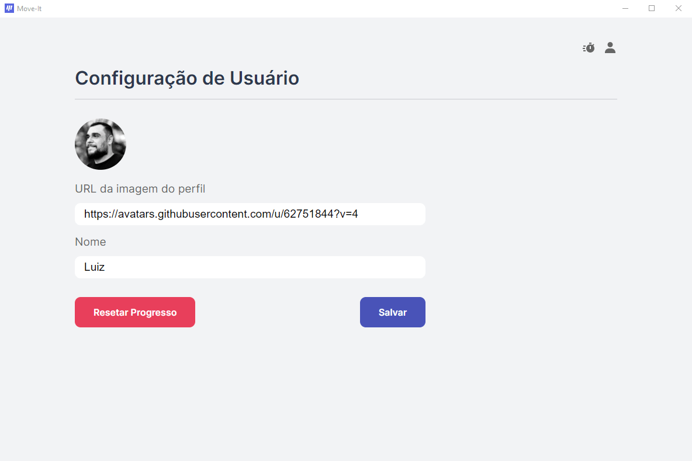

<p align="center">
  
</p>
<h1 align="center"> moveit-electron 🏃‍♂️ </h1>
<p>
  
  <a href="#" target="_blank">
    
  </a>
</p>

> 🏃‍♂️ Time controller for physical actives, project created at NLW #4. Port to Electron.js

### 🔽 [Download](https://github.com/luizfverissimo/moveit-electron/releases/tag/v0.1-alpha)
### 🏠 [Homepage](https://github.com/luizfverissimo/moveit-electron)

## Screenshots

   


## Install

```sh
yarn
```

## Usage

```sh
yarn watch # or npm run watch 
# in other terminal
yarn start # or npm start
```

## Author

👤 **Luiz Fernando Veríssimo**

* Website: https://lfverissimo.com
* Github: [@luizfverissimo](https://github.com/luizfverissimo)
* LinkedIn: [@lfverissimo](https://linkedin.com/in/lfverissimo)

## Show your support

Give a ⭐️ if this project helped you!

***
_This README was generated with ❤️ by [readme-md-generator](https://github.com/kefranabg/readme-md-generator)_
